###### Download The Repository from GitHub
###### Install Node,npm and React Js.
###### Run npm start in terminal.
###### TestCases are in the folder Named TestCases and to run it npm test.
###### Utils/CaluculateRewardPoints contains Calculation of Reward Points, Sorting the Last 3 months data by date and Aggregating transactions.
###### Utils/SortFilterPagination is for Pagination and adding option of Filter, Sort on every column of the tables.
###### Services/FetchData file contains Fetch Data to Fetch using try and catch
###### ModuleDrvers/Driver.jsx is used to Render the all components and it can be rendered in App.jsx in order avoid nested components import and to make it Pure.
###### Logs folder contains logger.js whcih will create logs upon fetch of data.
###### data.json contains Transactions Data which is inside a public folder.
#Find the screenshots below

  1. Calculation of reward points
    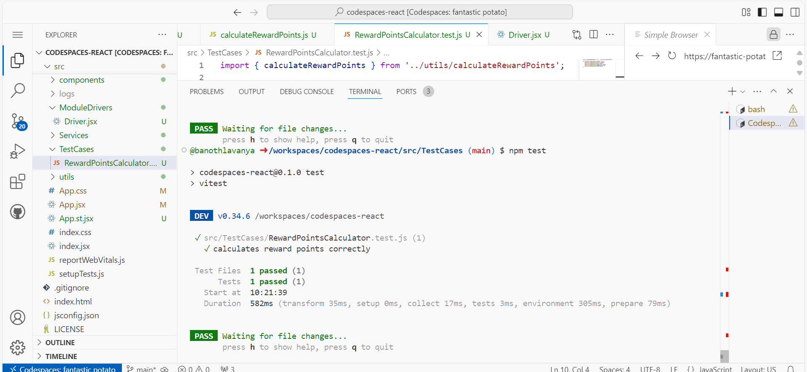
  
 #Desktop Screen:

  2. User Monthly reward points
    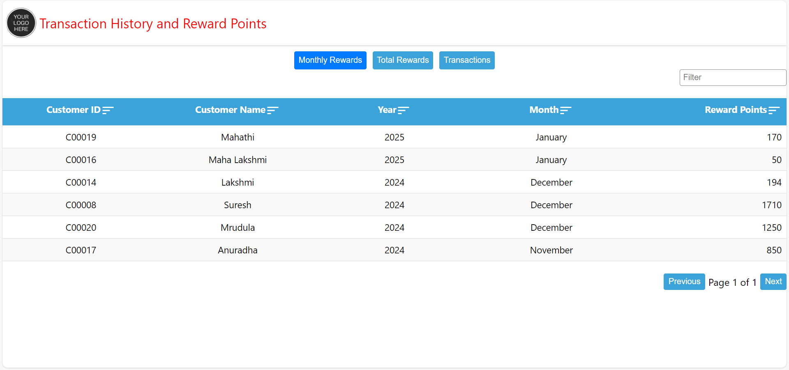

  3. Total Rewards
    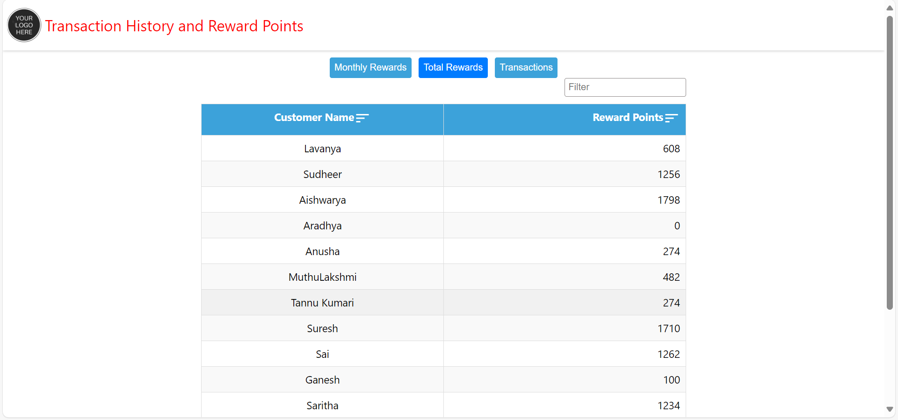
    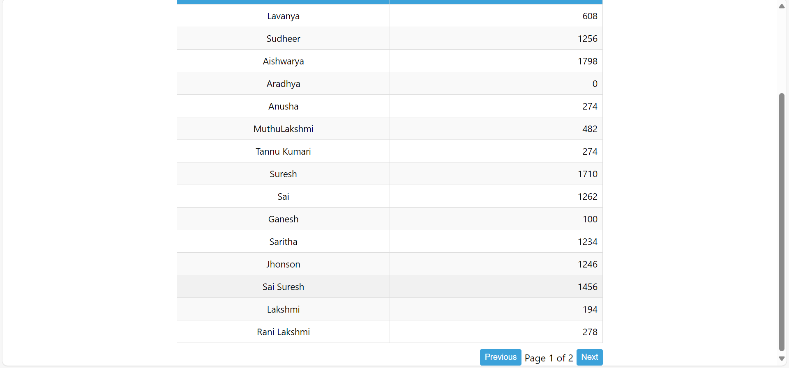

  4. Transactions
    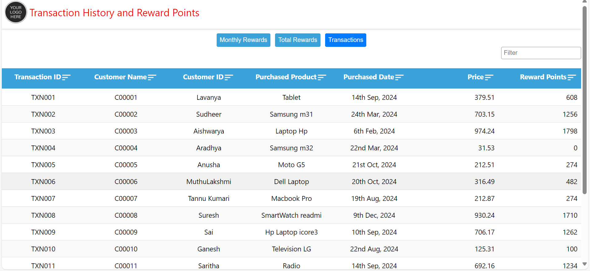
    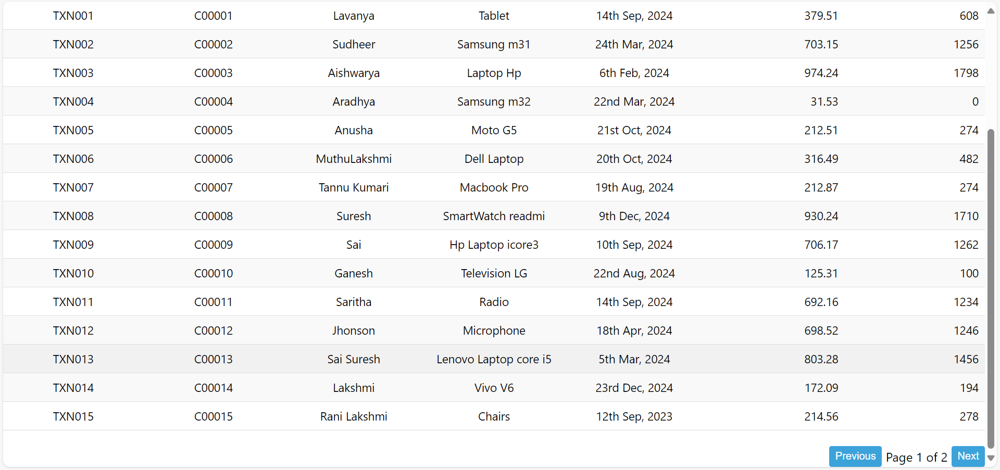
    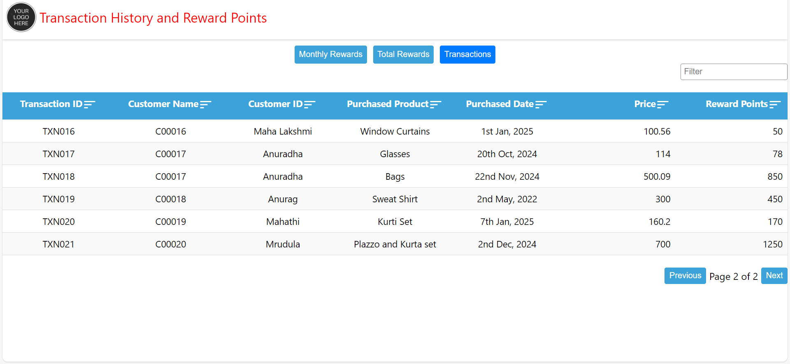

#Mobile Screens:
   1.UserMonthlyRewards
     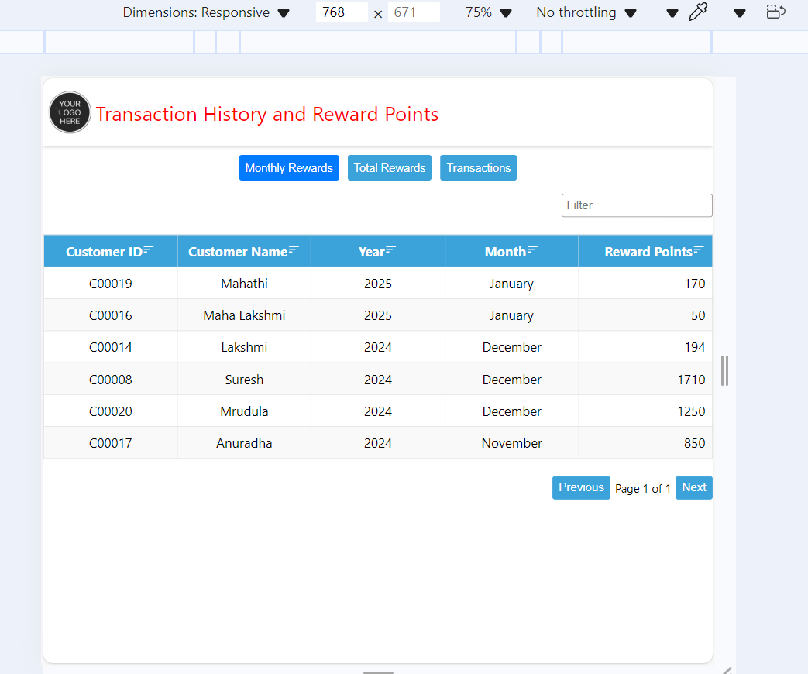
     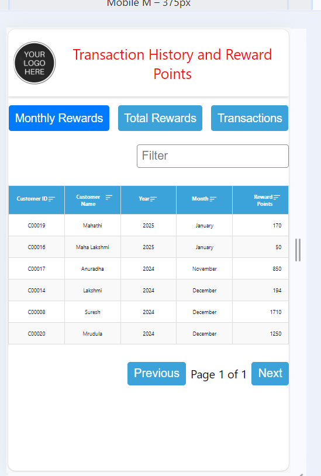

   2. Total Rewards
      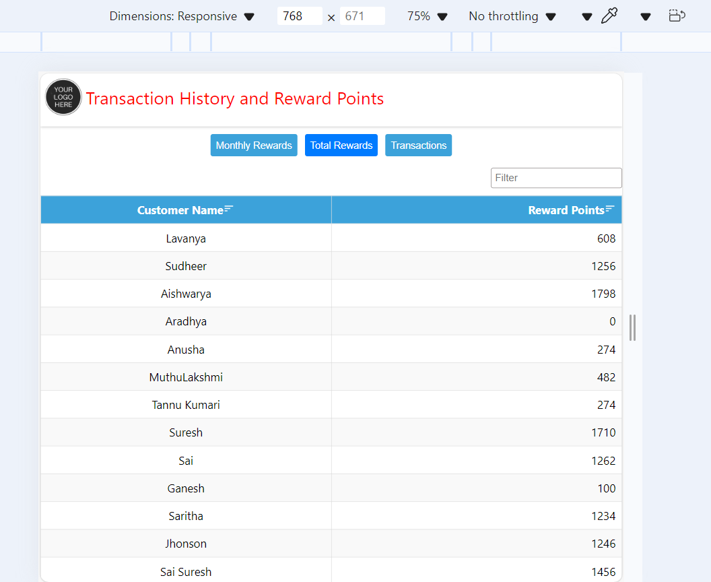
      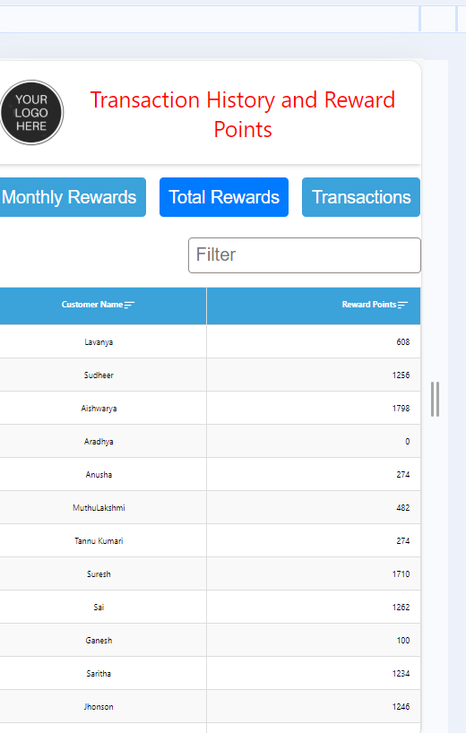

   3. Transactions
      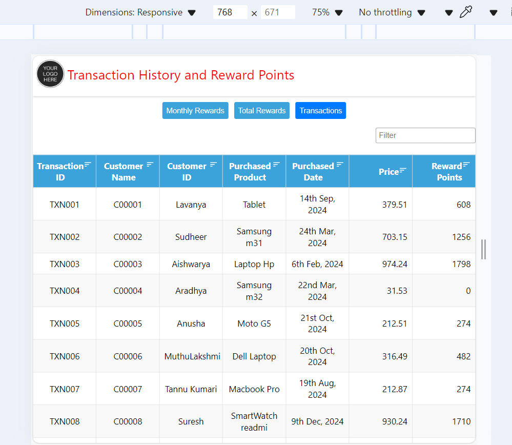
      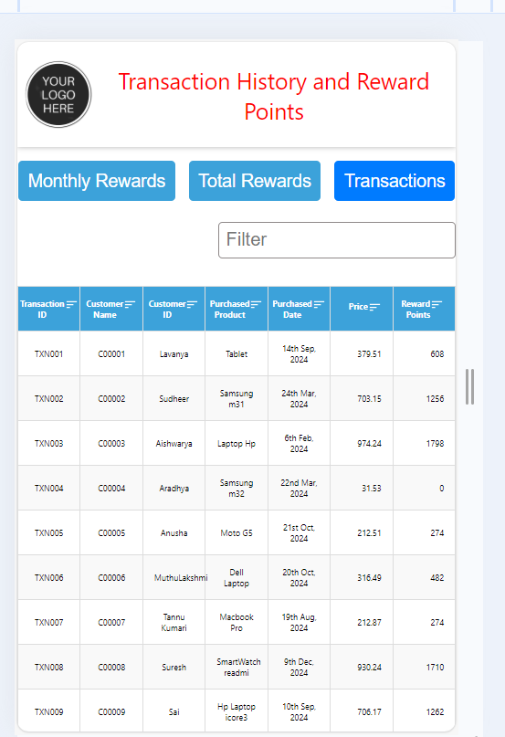
